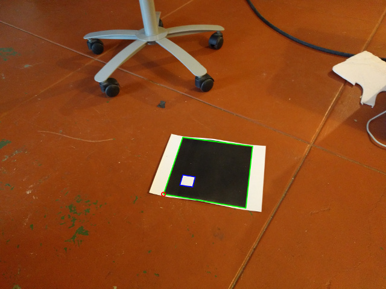
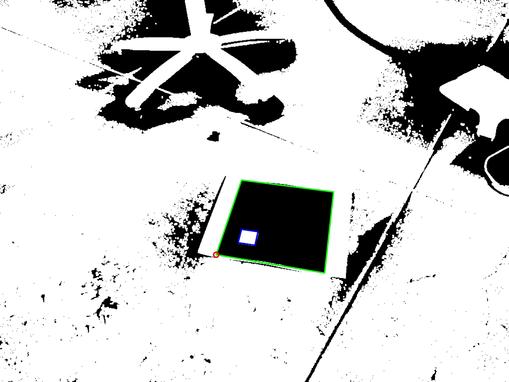
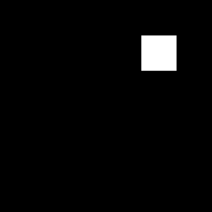

# AR testing

A very simple ar tag detector, using cv2

Identified Frame | Mask
------------ | -------------
 | 
 | 

## cam.py
Run this to show a live camera view

## AR.py
Cycle through all the test images

## artag.py
The ARTag object, for holding contours assorted with an ARTag

## AR_Target.png
The AR Target that I use

